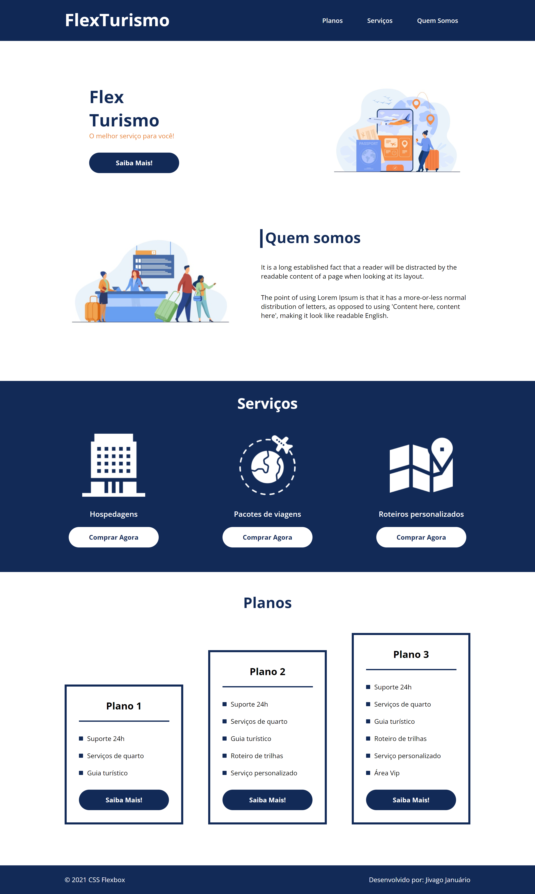

### 1º Site desenvolvido com base em modelo do curso de HTML/CSS da DIO. ([Link](https://jivasbr.github.io/dio-site-flex-turismo/))

###### Primeiros passos em desenvolvimento web com HTML/CSS.

#### Links:

* Arquivos HTML/CSS base: [http://gitlab.com/karensantos/project-flexbox-dio](https://gitlab.com/karensantos/project-flexbox-dio/-/tree/master/flex-projeto)

* Desenvolvimento na plataforma DIO: https://web.dio.me/users/jivago_januario

#### Print de tela:

